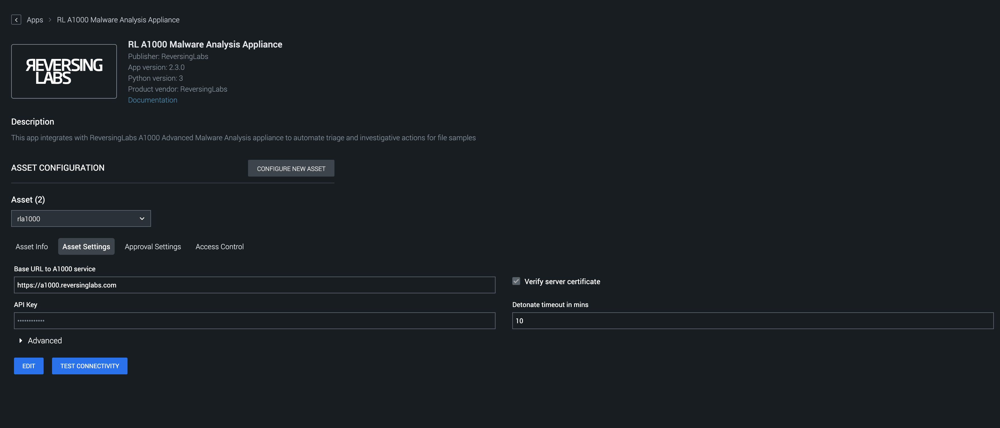

[comment]: # "Auto-generated SOAR connector documentation"
# RL A1000 Malware Analysis Appliance

Publisher: ReversingLabs  
Connector Version: 2\.3\.0  
Product Vendor: ReversingLabs  
Product Name: A1000  
Product Version Supported (regex): "\.\*"  
Minimum Product Version: 5\.1\.0  

This app integrates with ReversingLabs A1000 Advanced Malware Analysis appliance to automate triage and investigative actions for file samples

[comment]: # " File: README.md"
[comment]: # "  Copyright (c) ReversingLabs Inc 2016-2022"
[comment]: # "  Licensed under the Apache License, Version 2.0 (the 'License');"
[comment]: # "  you may not use this file except in compliance with the License."
[comment]: # "  You may obtain a copy of the License at"
[comment]: # ""
[comment]: # "      http://www.apache.org/licenses/LICENSE-2.0"
[comment]: # "  Unless required by applicable law or agreed to in writing, software distributed under"
[comment]: # "  the License is distributed on an 'AS IS' BASIS, WITHOUT WARRANTIES OR CONDITIONS OF ANY KIND,"
[comment]: # "  either express or implied. See the License for the specific language governing permissions"
[comment]: # "  and limitations under the License."
[comment]: # ""
# ReversingLabs A1000 Malware Analysis Appliance

This app supports using ReversingLabs Advanced File Analysis to 'detonate file' on the A1000
Advanced Malware Analysis Appliance.  
  
The A1000 appliance is a powerful threat detection and file analysis platform that integrates other
ReversingLabs technologies (TitaniumCore - the automated static analysis solution, and TitaniumCloud
File Reputation Service) to provide detailed information on each file's status and threat
capabilities.  
  
The A1000 makes it easy to upload multiple samples for analysis. It can process, unpack, and
classify them in a matter of milliseconds, and display detailed analysis reports. Historical
analysis results are preserved in a database to enable in-depth searching, and malware samples are
continually reanalyzed to ensure the most up-to-date file reputation status.  
  
The A1000 relies on several threat classification methods, including YARA rules and ReversingLabs
hashing algorithm (RHA) that classifies files based on their functional similarity.  
  
For more information, consult the [official product
website.](https://www.reversinglabs.com/products/malware-analysis-appliance.html)

## How to Configure the App

Access the Asset Settings tab on the Asset Configuration page. The variables described in the
previous section are displayed in this tab.  
  
  
  
The "Base URL" field requires the host address of the A1000 appliance. Select the "Verify server
certificate" checkbox to allow only commercial certificates, not the self-signed certificates.  
  
  
The "API Key" contains the authentication token obtained from an A1000 instance used for accessing
the A1000 REST API.  
  
  
The "Detonate timeout" variable defines how long the app should wait for the results from the A1000
appliance.

**Playbook Backward Compatibility**

Below mentioned actions and parameters have been added. Hence, it is requested to the end-user to
please update their existing playbooks by re-inserting\|adding\|deleting the corresponding action
blocks or by providing appropriate values to these action parameters to ensure the correct
functioning of the playbooks created on the earlier versions of the app.

-   The "hunting_report_vault_id" parameter has been added in "detonate file" and "get report"
    action.
-   Added a new action "local advanced search" - The action will query A1000 instance with a
    specified Advanced Search query.

## Port Information

The app uses HTTP/ HTTPS protocol for communicating with the RL A1000 Malware Analysis Appliance
server. Below are the default ports used by the Splunk SOAR Connector.

| SERVICE NAME | TRANSPORT PROTOCOL | PORT |
|--------------|--------------------|------|
| http         | tcp                | 80   |
| https        | tcp                | 443  |

### Configuration Variables
The below configuration variables are required for this Connector to operate.  These variables are specified when configuring a A1000 asset in SOAR.

VARIABLE | REQUIRED | TYPE | DESCRIPTION
-------- | -------- | ---- | -----------
**base\_url** |  required  | string | Base URL to A1000 service
**verify\_server\_cert** |  optional  | boolean | Verify server certificate
**api\_key** |  required  | password | API Key
**timeout** |  required  | numeric | Detonate timeout in mins

### Supported Actions  
[test connectivity](#action-test-connectivity) - Validate the asset configuration for connectivity by attempting to log into the device  
[detonate file](#action-detonate-file) - Analyze the file in the A1000 Advanced Malware Analysis Appliance and retrieve the analysis results  
[reanalyze file](#action-reanalyze-file) - Reanalyze the file in the A1000 Advanced Malware Analysis Appliance  
[get report](#action-get-report) - Get A1000 report for file  
[local advanced search](#action-local-advanced-search) - Queries A1000 instance with a specified Advanced Search query  

## action: 'test connectivity'
Validate the asset configuration for connectivity by attempting to log into the device

Type: **test**  
Read only: **True**

#### Action Parameters
No parameters are required for this action

#### Action Output
No Output  

## action: 'detonate file'
Analyze the file in the A1000 Advanced Malware Analysis Appliance and retrieve the analysis results

Type: **investigate**  
Read only: **True**

This action requires the input file to be present in the vault and therefore takes the vault id as the input parameter\.

#### Action Parameters
PARAMETER | REQUIRED | DESCRIPTION | TYPE | CONTAINS
--------- | -------- | ----------- | ---- | --------
**file\_vault\_id** |  required  | Vault ID of file to detonate | string |  `vault id` 
**file\_name** |  optional  | Filename to use | string |  `file name` 
**hunting\_report\_vault\_id** |  optional  | Threat hunting report vault id | string |  `vault id` 

#### Action Output
DATA PATH | TYPE | CONTAINS
--------- | ---- | --------
action\_result\.parameter\.file\_name | string |  `file name` 
action\_result\.parameter\.file\_vault\_id | string |  `vault id` 
action\_result\.parameter\.hunting\_report\_vault\_id | string |  `vault id` 
action\_result\.data\.\*\.hunting\_report\_vault\_id | string |  `vault id` 
action\_result\.data\.\*\.readable\_summary\.classification\.classification | string | 
action\_result\.data\.\*\.readable\_summary\.classification\.description | string | 
action\_result\.data\.\*\.readable\_summary\.classification\.reason | string | 
action\_result\.data\.\*\.readable\_summary\.classification\.threat\.name | string | 
action\_result\.data\.\*\.readable\_summary\.classification\.threat\.description | string | 
action\_result\.data\.\*\.readable\_summary\.classification\.threat\.factor | numeric | 
action\_result\.status | string | 
action\_result\.message | string | 
action\_result\.summary | string | 
summary\.total\_objects | numeric | 
summary\.total\_objects\_successful | numeric |   

## action: 'reanalyze file'
Reanalyze the file in the A1000 Advanced Malware Analysis Appliance

Type: **investigate**  
Read only: **True**

This action requires the input file to be present in the vault and therefore takes the vault id as the input parameter\.

#### Action Parameters
PARAMETER | REQUIRED | DESCRIPTION | TYPE | CONTAINS
--------- | -------- | ----------- | ---- | --------
**file\_vault\_id** |  required  | Vault ID of file to detonate | string |  `vault id` 
**file\_name** |  optional  | Filename to use | string |  `file name` 

#### Action Output
DATA PATH | TYPE | CONTAINS
--------- | ---- | --------
action\_result\.parameter\.file\_name | string |  `file name` 
action\_result\.parameter\.file\_vault\_id | string |  `vault id` 
action\_result\.data | string | 
action\_result\.status | string | 
action\_result\.message | string | 
action\_result\.summary\.response | string | 
summary\.total\_objects | numeric | 
summary\.total\_objects\_successful | numeric |   

## action: 'get report'
Get A1000 report for file

Type: **investigate**  
Read only: **True**

This action requires hash to get report from A1000\.

#### Action Parameters
PARAMETER | REQUIRED | DESCRIPTION | TYPE | CONTAINS
--------- | -------- | ----------- | ---- | --------
**file\_vault\_id** |  required  | Vault ID of file to get report | string |  `vault id` 
**file\_name** |  optional  | Filename to use | string |  `file name` 
**hunting\_report\_vault\_id** |  optional  | Threat hunting report vault id | string |  `vault id` 

#### Action Output
DATA PATH | TYPE | CONTAINS
--------- | ---- | --------
action\_result\.parameter\.file\_name | string |  `file name` 
action\_result\.parameter\.file\_vault\_id | string |  `vault id` 
action\_result\.parameter\.hunting\_report\_vault\_id | string |  `vault id` 
action\_result\.data\.\*\.hunting\_report\_vault\_id | string |  `vault id` 
action\_result\.data\.\*\.readable\_summary\.classification\.classification | string | 
action\_result\.data\.\*\.readable\_summary\.classification\.description | string | 
action\_result\.data\.\*\.readable\_summary\.classification\.reason | string | 
action\_result\.data\.\*\.readable\_summary\.classification\.threat\.description | string | 
action\_result\.data\.\*\.readable\_summary\.classification\.threat\.factor | numeric | 
action\_result\.data\.\*\.readable\_summary\.classification\.threat\.name | string | 
action\_result\.status | string | 
action\_result\.message | string | 
action\_result\.summary | string | 
summary\.total\_objects | numeric | 
summary\.total\_objects\_successful | numeric |   

## action: 'local advanced search'
Queries A1000 instance with a specified Advanced Search query

Type: **investigate**  
Read only: **True**

#### Action Parameters
PARAMETER | REQUIRED | DESCRIPTION | TYPE | CONTAINS
--------- | -------- | ----------- | ---- | --------
**search\_parameter** |  optional  | Advanced Search query search field | string | 
**results\_per\_page** |  optional  | Number of results per one page \(Default\:1000\) | numeric | 
**page\_number** |  optional  | Page number \(Default\:1\) | numeric | 
**hunting\_report\_vault\_id** |  optional  | Threat hunting report vault id | string |  `vault id` 

#### Action Output
DATA PATH | TYPE | CONTAINS
--------- | ---- | --------
action\_result\.parameter\.hunting\_report\_vault\_id | string |  `vault id` 
action\_result\.parameter\.page\_number | numeric | 
action\_result\.parameter\.results\_per\_page | numeric | 
action\_result\.parameter\.search\_parameter | string | 
action\_result\.data\.\*\.hunting\_report\_vault\_id | string |  `vault id` 
action\_result\.data\.\*\.readable\_summary\.classification\.classification | string | 
action\_result\.data\.\*\.readable\_summary\.classification\.description | string | 
action\_result\.data\.\*\.readable\_summary\.classification\.reason | string | 
action\_result\.data\.\*\.readable\_summary\.classification\.threat\.description | string | 
action\_result\.data\.\*\.readable\_summary\.classification\.threat\.factor | numeric | 
action\_result\.data\.\*\.readable\_summary\.classification\.threat\.name | string | 
action\_result\.status | string | 
action\_result\.message | string | 
action\_result\.summary | string | 
summary\.total\_objects | numeric | 
summary\.total\_objects\_successful | numeric | 